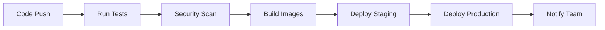

# QR Café - Digital Menu Platform

QR Café is a lightweight digital menu platform for small cafés and eateries. Café owners can sign up, add or edit menu items, and generate a unique QR code linked to their digital menu. Customers simply scan the QR code to view the latest menu on their phones.

## 🚀 Features

- **Digital Menu Management**: Easy-to-use interface for café owners to manage their menu
- **QR Code Generation**: Automatic QR code generation for contactless menu access
- **Customer Ordering**: Shopping cart system with secure payment integration
- **Real-time Updates**: Menu changes reflect immediately on customer devices
- **Mobile Responsive**: Optimized for all device sizes
- **Payment Integration**: Support for online payments and UPI QR codes

## 🏗️ Architecture

### Tech Stack
- **Frontend**: React.js + TypeScript + Tailwind CSS
- **Backend**: Node.js + Express.js
- **Database**: MongoDB
- **Authentication**: JWT
- **QR Code**: qrcode npm package
- **Payments**: Razorpay/UPI integration

### DevOps Stack
- **Containerization**: Docker + Docker Compose
- **Orchestration**: Kubernetes
- **CI/CD**: GitHub Actions
- **Monitoring**: Prometheus + Grafana
- **Alerting**: Alertmanager with email notifications
- **Security**: Trivy vulnerability scanning

## 📁 Project Structure

```
qr-cafe/
├── src/                          # Frontend React application
│   ├── components/               # React components
│   │   ├── LandingPage.tsx
│   │   ├── CafeOwnerDashboard.tsx
│   │   ├── CustomerMenu.tsx
│   │   ├── Cart.tsx
│   │   └── OrderStatus.tsx
│   └── pages/
├── backend/                      # Node.js backend
│   ├── routes/                   # API routes
│   ├── models/                   # Database models
│   ├── middleware/               # Express middleware
│   └── server.js                 # Main server file
├── k8s/                          # Kubernetes manifests
│   ├── mongodb-deployment.yaml
│   ├── backend-deployment.yaml
│   ├── frontend-deployment.yaml
│   └── monitoring/
├── monitoring/                   # Monitoring configuration
│   ├── prometheus.yml
│   ├── alert_rules.yml
│   └── alertmanager.yml
├── .github/workflows/            # CI/CD pipelines
│   └── ci-cd.yml
├── docker-compose.yml            # Local development setup
├── Dockerfile.frontend
└── backend/Dockerfile
```

## 🛠️ Setup Instructions

### Prerequisites

- Node.js 18+ 
- Docker & Docker Compose
- Git
- (Optional) Kubernetes cluster for production deployment

### 1. Clone the Repository

```bash
git clone <repository-url>
cd qr-cafe
```

### 2. Local Development Setup

#### Option A: Using Docker Compose (Recommended)

```bash
# Start all services
docker-compose up -d

# View logs
docker-compose logs -f

# Stop services
docker-compose down
```

#### Option B: Manual Setup

**Frontend:**
```bash
# Install dependencies
npm install

# Start development server
npm run dev
```

**Backend:**
```bash
cd backend

# Install dependencies
npm install

# Set environment variables
cp .env.example .env
# Edit .env with your configuration

# Start development server
npm run dev
```

**Database:**
```bash
# Using Docker
docker run -d --name mongodb -p 27017:27017 mongo:6.0

# Or install MongoDB locally
```

### 3. Production Deployment

#### Using Docker Compose

```bash
# Production deployment
docker-compose -f docker-compose.yml up -d
```

#### Using Kubernetes

```bash
# Create namespace
kubectl apply -f k8s/namespace.yaml

# Deploy secrets
kubectl apply -f k8s/secrets.yaml

# Deploy MongoDB
kubectl apply -f k8s/mongodb-deployment.yaml

# Deploy backend
kubectl apply -f k8s/backend-deployment.yaml

# Deploy frontend
kubectl apply -f k8s/frontend-deployment.yaml

# Deploy monitoring
kubectl apply -f k8s/monitoring/
```

## 📊 Monitoring & Observability

### Accessing Monitoring Dashboards

- **Prometheus**: http://localhost:9090
- **Grafana**: http://localhost:3030 (admin:admin123)
- **Application**: http://localhost:3000

### Key Metrics Monitored

- Application uptime and response times
- Database connection status
- System resource usage (CPU, Memory, Disk)
- Custom business metrics (orders, menu items)

### Alerting

Alerts are configured for:
- Service downtime
- High resource usage
- Database connectivity issues
- Application errors

Email notifications are sent to configured recipients when alerts trigger.

## 🚀 CI/CD Pipeline

The GitHub Actions workflow includes:

1. **Testing**: Automated tests for frontend and backend
2. **Security Scanning**: Vulnerability scanning with Trivy
3. **Building**: Docker image building and pushing to registry
4. **Deployment**: Automated deployment to staging/production
5. **Monitoring**: Health checks and rollback capabilities

### Pipeline Stages



## 🔧 Configuration

### Environment Variables

**Backend (.env):**
```env
NODE_ENV=production
PORT=3001
MONGODB_URI=mongodb://localhost:27017/qrcafe
JWT_SECRET=your-super-secret-jwt-key
FRONTEND_URL=http://localhost:3000
```

**Frontend:**
```env
REACT_APP_API_URL=http://localhost:3001
```

### Monitoring Configuration

Update the following files for your environment:
- `monitoring/alertmanager.yml` - Email configuration
- `monitoring/prometheus.yml` - Scrape targets
- `k8s/secrets.yaml` - Production secrets

## 📱 Usage

### For Café Owners

1. Visit the landing page and create a café
2. Add menu items with prices and descriptions
3. Generate a QR code for your café
4. Print and display the QR code in your café
5. Manage orders through the dashboard

### For Customers

1. Scan the QR code with your phone
2. Browse the digital menu
3. Add items to your cart
4. Provide table number and payment method
5. Track your order status

## 🔒 Security Features

- JWT-based authentication
- Input validation and sanitization
- Rate limiting
- CORS protection
- Helmet.js security headers
- Container vulnerability scanning
- Secrets management

## 📈 Performance

- Nginx reverse proxy for static assets
- Docker multi-stage builds for optimized images
- MongoDB indexing for fast queries
- React code splitting and lazy loading
- CDN-ready static assets

## 🐛 Troubleshooting

### Common Issues

**Frontend not loading:**
```bash
# Check if services are running
docker-compose ps

# Check logs
docker-compose logs frontend
```

**Backend API errors:**
```bash
# Check backend logs
docker-compose logs backend

# Verify database connection
docker-compose exec mongodb mongo --eval "db.stats()"
```

**Monitoring not working:**
```bash
# Check Prometheus targets
curl http://localhost:9090/api/v1/targets

# Restart monitoring stack
docker-compose restart prometheus grafana
```

## 🤝 Contributing

1. Fork the repository
2. Create a feature branch
3. Make your changes
4. Add tests for new functionality
5. Submit a pull request

## 📄 License

This project is licensed under the MIT License - see the LICENSE file for details.

## 📞 Support

For support and questions:
- Create an issue in the GitHub repository
- Email: support@qrcafe.com
- Documentation: [Wiki](./wiki)

---

**Happy Coding! ☕️**
